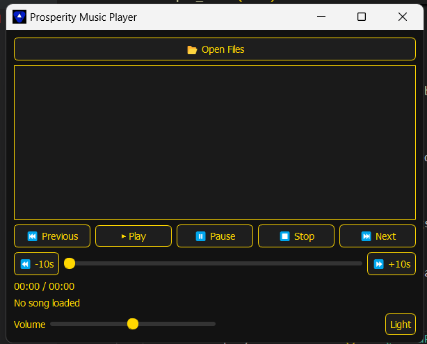
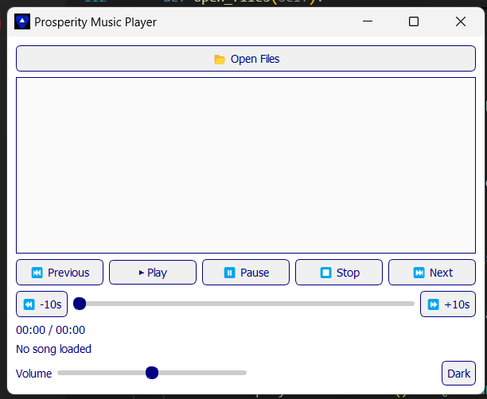

#  Prosperity Music Player

A simple yet elegant desktop music player built with **Python** and **PyQt5**.  
It supports playlists, audio playback controls, volume adjustment, theme switching (Dark & Light mode), and seamless navigation between songs.

---

## ✨ Features

- 📂 **Open Multiple Files** – Load `.mp3` and `.wav` songs into the playlist.  
- ▶ **Playback Controls** – Play, pause, stop, next, and previous songs.  
- ⏪⏩ **Seek Controls** – Jump forward or backward by 10 seconds.  
- 🔊 **Volume Control** – Adjustable volume with a slider.  
- 📜 **Playlist Support** – Double-click to play any song in the playlist.  
- ⏱ **Progress Bar & Timer** – Displays elapsed and total duration of the song.  
- 🌗 **Theme Switcher** – Toggle between **Dark Mode (gold + black)** and **Light Mode (blue + white)**.  
- 🔄 **Auto Next** – Automatically plays the next song when the current one finishes.  
- 🎨 **Custom Logo Support** – Displays your own app icon (`mylogo.jpg`).  

---

## 📸 Screenshots

| Dark Mode | Light Mode |
|-----------|------------|
|  |  |


---

## 🛠️ Installation & Setup

1. **Clone the repository**
   ```bash
   git clone https://github.com/yourusername/music-player.git
   cd music-player

2. **Create a virtual environment (recommended)**
    ```
    python -m venv venv
    source venv/bin/activate   # On macOS/Linux
    venv\Scripts\activate      # On Windows

3. **Install dependencies**
    ```
    pip install PyQt5

4. **Run the application**
    ```
    python music_player.py
